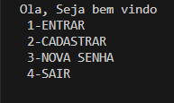

# 🛠️ Sistema de Cadastro em Java (Simples)

Projeto simples em Java que simula um sistema de login com cadastro de usuário, alteração de senha e verificação de dados. Criado como exercício de prática com entrada de dados e estruturas condicionais.

---

## 🚀 Tecnologias usadas

- Java
- Scanner (entrada de dados)
- IDEs: Eclipse ou NetBeans

---

## 📸 Exemplo da interface



---

## 🔧 Como usar

1. Clone o repositório:
   ```bash
   git clone https://github.com/Abimael-bak/Sistema-Cadastro-Java.git

    Abra o projeto na sua IDE (Eclipse ou NetBeans)

    Compile e execute o arquivo Login.java

🧠 Conceitos praticados

    Entrada e saída de dados (Scanner)

    Estruturas condicionais (if, else if, while)

    Métodos estáticos

    Organização de fluxos simples (menu interativo)

    Manipulação de variáveis

📌 Funcionalidades

    Cadastro de nome, senha, idade e CPF

    Login com verificação de senha

    Alteração de senha

    Visualização dos dados cadastrados

✍️ Autor

Abimael de Jesus Abreu
LinkedIn
GitHub

🔗 Acesse o projeto online:  
👉 [https://abimael-bak.github.io/Sistemas-Cadastro-Java/](https://abimael-bak.github.io/Sistema-Cadastro-Java/)

